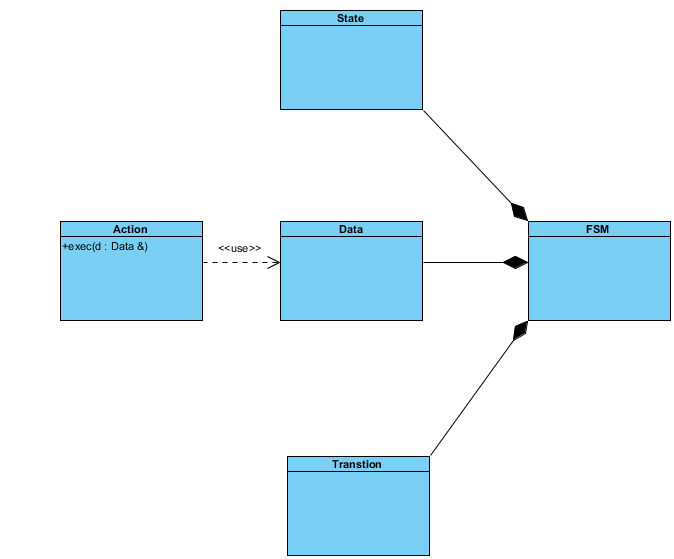

[](https://travis-ci.com/johnsourour/FSM_Framework)
<br />

# FSM Framework

#### Description

```
A Finite State Machine framework that can help model and implement a program 
by defining several states, transitions and actions.
```

#### Class Diagram



 * FSM:
    This will be the main class that wraps everything
 * Data:
    This class will be mainly responsible for data setting, manipulation and retrieval
 * State
    This class defines every state in the system.
 * Transition 
    This class will be responsible for the flow of the execution of the finite
    state machine
 * Action:
    This class defined the Action on the Data that will be executed inside each state
 
 ###### Note:  Action is defined as an abstract class for the user to implemented custom actions for his state
  
    
 #### Testing
 
 To test this framework, two set of tests are going to be applied:
  * Unit Testing; test for as much as possible of the functions of the FSM class
  * [Conway's Game Of Life](https://en.wikipedia.org/wiki/Conway%27s_Game_of_Life) simulator


